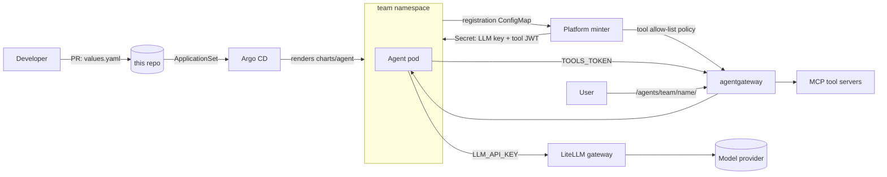

# Agent Golden Path

A self-service way to put AI agents into production on Kubernetes, with the
guard rails already on. A developer writes one `values.yaml`, opens a pull
request, and Argo CD deploys the agent. The developer never sees a credential
and cannot turn a guard rail off.

## The problems it solves

Every row was tested on a running cluster. The full map of eighteen concerns,
with the tool behind each answer and what is still open, is in
[SPIKE.md](SPIKE.md).

| Problem | What happens instead | Proven by |
|---|---|---|
| Staff paste model keys into Deployments | Pods never hold a provider key. The LLM gateway keeps the real keys and mints one scoped virtual key per agent. Network policy makes the gateway the only route to a model | An agent pod cannot reach the model host. The same pod reaches the gateway. A pod without the policy reaches the model host |
| An agent runs up a bill | A hard monthly budget per agent, and a cap per team that no number of agents can exceed. Both are enforced at the gateway, not in the agent | A $0.0001 key was refused its second call. A team capped at $1e-7 could not mint a key with $100 left on it |
| An agent calls a tool it should not | Tools come from a platform catalog. A per-agent allow-list at the tool gateway hides everything else from `tools/list`. Writes can require a human to approve each call | One token sees 3 of 18 tools. A hidden tool returns "Unknown tool". "Cancel order 1004" stopped in `input-required` and the order was untouched |
| Non-developers cannot ship a container | `kind: prompt` is a system prompt and a tool list. No code, no image. The platform runs it | Two agents run from a values file alone, one of them across a namespace boundary |
| Generated code needs isolation | `kind: codeexec` claims a pre-warmed sandbox with a non-root, read-only filesystem and its own default-deny network policy | Claim served in seconds. `touch /etc/x` fails. Egress to the model host is blocked |
| Teams step on each other | One Argo CD project per team allows one repo and one namespace, and no cluster-scoped resources | Argo refused an app aimed at another namespace, an app from a foreign repo, and an attempt to create a namespace |
| Deleting the agent does not end the bill | The chart registers each agent. A platform minter turns that into keys and policies, and removes them when the registration is gone | Deleting an agent's folder removed its workload, its ConfigMaps, its minted Secret, its gateway policy, and its model key |
| Agents need to work together | An agent may list another team's agent as a tool, but only if that team consents in its own values | A concierge delegated to a specialist in another namespace. An agent from an unlisted namespace was refused |

This repo is the whole thing: the platform install, the dev-facing Helm chart,
the GitOps wiring, the credential minter, the CI, and the docs. It runs end to
end on a laptop with `kind` and a local model.

## Why this exists

Platform teams already ship golden paths for normal apps: a universal Helm
chart, hardened base images, shared CI. Agents broke that pattern. They call
paid models, they call tools that can change systems, and they were being
built by people who are not engineers. Each team was about to solve
model keys, tool access, budgets, and isolation on its own. This project makes
those decisions once, in the platform, and gives every agent the same shape.

The research that led here is in
[docs/research](docs/research/2026-09-05-agent-deployment-golden-path.md).

## What a developer does

```yaml
# deployments/agents/demo/vibe-app/values.yaml
name: vibe-app
team: demo
owner: dackota.j@gmail.com
description: A chat app that calls an LLM and one read-only tool.
kind: container
image: ghcr.io/dackota/agent-app-template:0.2.0
systemPrompt: You are a friendly helper. Keep answers under 30 words.
tools:
  - name: k8s-readonly
budget:
  usdPerMonth: 10
```

Merge that and within about a minute the agent answers at
`http://<gateway>/agents/demo/vibe-app/`. It can call exactly three read-only
Kubernetes tools and spend at most ten dollars a month. See the
[dev guide](docs/dev-guide.md).

## How it works



Three kinds of agent, one chart:

| `kind` | For | Runs as |
|---|---|---|
| `prompt` | A system prompt plus tools. No code. | A kagent `Agent` |
| `container` | Your own HTTP app image | Deployment or CronJob behind the gateway |
| `codeexec` | An agent that runs generated code | An isolated sandbox from a warm pool |

Two worked examples show the parts that make agents a system rather than a
pile: an internal REST API exposed as MCP tools, and a front-door agent that
delegates to another team's specialist over A2A. See
[docs/examples.md](docs/examples.md).

Read [docs/architecture.md](docs/architecture.md) for the flows, and
[docs/tooling.md](docs/tooling.md) for what each tool does and why it was picked.

## Run it yourself

Needs Docker, kind, Helm, kubectl, Python 3 with PyYAML, and
[Ollama](https://ollama.com) with `gemma4:12b` pulled.

```
make up        # kind cluster, platform, Argo CD, demo agents
make status    # watch Argo sync and the minter do its work
make test      # chart lint, render, and schema negative tests
make down
```

Then talk to an agent through the gateway:

```
kubectl --context kind-agent-spike -n agentgateway-system port-forward svc/agentgateway-proxy 8080:80 &
curl -s -X POST localhost:8080/agents/demo/vibe-app/chat -H 'Content-Type: application/json' \
  -d '{"message":"How many pods run in namespace team-demo? Use a tool."}'
```

## Repo layout

```
charts/agent/        the dev-facing chart. One kind switch. Strict schema.
deployments/agents/  <team>/<name>/values.yaml. PR here to deploy. Argo watches it.
platform/            platform-owned: gateways, minter, kagent, sandbox, tools, Argo wiring
examples/orders/     a REST API and its MCP wrapper, the "API as tools" example
apps/                source for agent images this repo owns
template/            the starter app a dev copies (mirrored to agent-app-template)
tests/               schema negative tests, run in CI
docs/                architecture, tooling, guard rails, guides, decisions
.github/workflows/   validate (PRs), build-agent (reusable), publish-images
```

## Status

A working proof of concept on kind. What is deliberately out of scope, and
what each reader should open first, is at the bottom of [SPIKE.md](SPIKE.md). The [platform guide](docs/platform-guide.md)
lists what changes for a real cluster: an identity provider as the JWT issuer,
gVisor on the sandbox nodes, signature enforcement at admission, and a
production trace backend. Decisions and their trade-offs are in
[docs/decisions](docs/decisions/).
