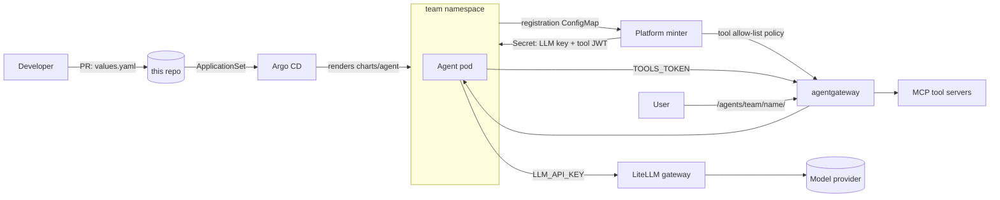

# Agent Golden Path

A self-service way to put AI agents into production on Kubernetes, with the
guard rails already on.

A developer writes one `values.yaml`, opens a pull request, and Argo CD
deploys the agent. The platform hands the agent a budgeted model key, a scoped
tool token, a URL, network rules, and an isolated runtime. The developer never
sees a credential and cannot turn a guard rail off.

This repo is the whole thing: the platform install, the dev-facing Helm chart,
the GitOps wiring, the credential minter, the CI, and the docs. It runs end to
end on a laptop with `kind` and a local model.

## Why this exists

Platform teams already ship golden paths for normal apps: a universal Helm
chart, hardened base images, shared CI. Agents broke that pattern. They call
paid models, they call tools that can change systems, and they were being
built by people who are not backend engineers. Each team was about to solve
model keys, tool access, budgets, and isolation on its own. This project makes
those decisions once, in the platform, and gives every agent the same shape.

The research that led here is in
[docs/research](docs/research/2026-09-05-agent-deployment-golden-path.md).
The full proof log of what was built and tested is in
[docs/spike-log.md](docs/spike-log.md).

## What a developer does

```yaml
# deployments/agents/demo/vibe-app/values.yaml
name: vibe-app
team: demo
owner: dackota.j@gmail.com
description: A chat app that calls an LLM and one read-only tool.
kind: container
image: ghcr.io/dackota/agent-app-template:0.2.0
systemPrompt: You are a friendly helper. Keep answers under 30 words.
tools:
  - name: k8s-readonly
budget:
  usdPerMonth: 10
```

Merge that and within about a minute the agent answers at
`http://<gateway>/agents/demo/vibe-app/`. It can call exactly three read-only
Kubernetes tools and spend at most ten dollars a month. See the
[dev guide](docs/dev-guide.md).

## How it works



Three kinds of agent, one chart:

| `kind` | For | Runs as |
|---|---|---|
| `prompt` | A system prompt plus tools. No code. | A kagent `Agent` |
| `container` | Your own HTTP app image | Deployment or CronJob behind the gateway |
| `codeexec` | An agent that runs generated code | An isolated sandbox from a warm pool |

Read [docs/architecture.md](docs/architecture.md) for the flows, and
[docs/tooling.md](docs/tooling.md) for what each tool does and why it was picked.

## Guard rails

Every one of these was tested. The proof is in [docs/guard-rails.md](docs/guard-rails.md).

- Only catalog models. Only catalog tools. Only signed images from allowed registries. No `:latest`.
- A hard monthly budget per agent, enforced at the LLM gateway.
- A per-agent tool allow-list. Hidden tools do not even appear in `tools/list`.
- Default-deny network egress. An agent pod can reach DNS and the two gateways. Nothing else.
- Non-root, read-only filesystem, no capabilities, no service account token.
- A team can deploy only into its own namespace, only from this repo.
- Human approval per tool for prompt agents.
- Delete the folder and everything goes, including the minted credentials.

## Run it yourself

Needs Docker, kind, Helm, kubectl, Python 3 with PyYAML, and
[Ollama](https://ollama.com) with `gemma4:12b` pulled.

```
make up        # kind cluster, platform, Argo CD, demo agents
make status    # watch Argo sync and the minter do its work
make test      # chart lint, render, and schema negative tests
make down
```

Then talk to an agent through the gateway:

```
kubectl --context kind-agent-spike -n agentgateway-system port-forward svc/agentgateway-proxy 8080:80 &
curl -s -X POST localhost:8080/agents/demo/vibe-app/chat -H 'Content-Type: application/json' \
  -d '{"message":"How many pods run in namespace team-demo? Use a tool."}'
```

## Repo layout

```
charts/agent/        the dev-facing chart. One kind switch. Strict schema.
deployments/agents/  <team>/<name>/values.yaml. PR here to deploy. Argo watches it.
platform/            platform-owned: gateways, minter, kagent, sandbox, Argo wiring
template/            the starter app a dev copies (mirrored to agent-app-template)
tests/               schema negative tests, run in CI
docs/                architecture, tooling, guard rails, guides, decisions
.github/workflows/   validate (PRs), build-agent (reusable), publish-minter
```

## Status

A working proof of concept on kind. The [platform guide](docs/platform-guide.md)
lists what changes for a real cluster: an identity provider as the JWT issuer,
gVisor on the sandbox nodes, signature enforcement at admission, and
OpenTelemetry collection. Decisions and their trade-offs are in
[docs/decisions](docs/decisions/).
