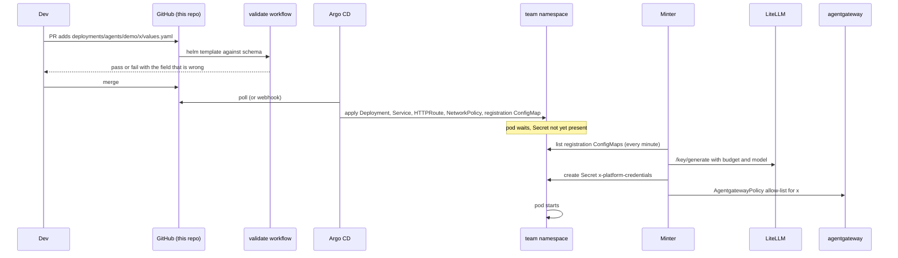
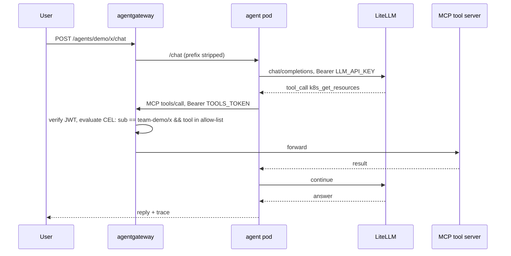

# Architecture

## Components

| Component | Namespace | Owner | Job |
|---|---|---|---|
| Argo CD | `argocd` | platform | Turns `deployments/agents/<team>/<name>/` into an Application and keeps it in sync |
| `charts/agent` | in git | platform | Renders one agent's resources from `values.yaml` |
| Platform minter | `platform-gateway` | platform | Creates each agent's credentials Secret and tool policy from its registration |
| LiteLLM | `platform-gateway` | platform | LLM gateway. Holds provider keys. Per-agent keys with budgets and model allow-lists |
| agentgateway | `agentgateway-system` | platform | Gateway API data plane. Fronts MCP tool servers with JWT auth and CEL allow-lists. Also the public route to container agents |
| kagent | `kagent` | platform | Runs `prompt` agents from a CRD. Ships the MCP tool servers used in the catalog |
| agent-sandbox | `agent-sandbox-system` | platform | Warm pool of isolated pods for `codeexec` agents |
| Observability | `platform-observability` | platform | OpenTelemetry Collector as Service `otel-collector`. Receives traces and logs from agents, kagent, agentgateway, and LiteLLM. Scrapes their metrics. Forwards to `otel-lgtm` on kind, the org stack elsewhere |
| Agent pods | `team-<team>` | team | The agents themselves |

## Deploy flow

## Request flow for a container agent

## Credential flow

No credential is written by a human or committed to git.

1. The chart renders a `ConfigMap` named `<name>-agent` with the label
   `goldenpath.dev/registration: "true"`. It contains name, team, owner,
   model, budget, and the expanded list of tool names.
2. The minter reads every such ConfigMap across the cluster.
3. For each one without a Secret it mints a LiteLLM virtual key
   (`max_budget`, `budget_duration: 30d`, `models: [<model>]`) and, if the
   agent has tools, an RS256 JWT with `sub: team-<team>/<name>` and
   `aud: platform-tools`.
4. It writes both into `Secret <name>-platform-credentials` in the team
   namespace and applies an `AgentgatewayPolicy` in `platform-gateway` whose
   CEL expression names that `sub` and the allowed tool names.
5. When the registration disappears, the minter deletes the Secret and the
   policy.

The chart only knows the Secret's name. Pods reference it and wait.

## Network model

Each container agent gets a `NetworkPolicy`:

- Ingress from the agentgateway proxy and from its own namespace, on its port.
- Egress to `kube-system` DNS, to the LiteLLM pod on 4000, to the agentgateway
  proxy on 80, and to the OTel collector namespace on 4318.
- Everything else is denied. This was verified: a pod with the policy cannot
  reach the model host directly. A pod without it can.

Sandboxes get the same shape from the platform `SandboxTemplate`, minus ingress.

## Identity

Two identities exist per agent today. The LiteLLM virtual key identifies it to
the model gateway. The JWT `sub` identifies it to the tool gateway. Both are
minted by the platform and carry the team and owner in metadata, so spend and
tool calls can be attributed. The `ServiceAccount` carries a placeholder
annotation for cloud workload identity. That is the third identity a real
cluster adds.
