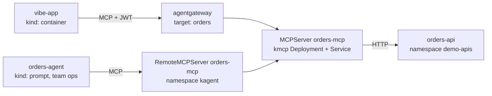
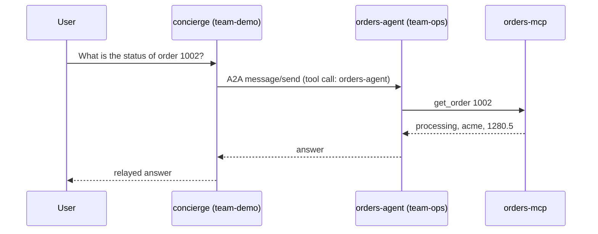

# Worked examples

Both examples run in `make up`. They show the two kagent features that turn a
set of agents into a system: an internal API exposed as tools, and agents that
delegate to each other.

## 1. An internal API as agent tools

Most useful tools are not "search the web". They are the company's own APIs.
This example wraps a REST API as MCP tools with no framework.



Pieces, all under `examples/orders/` and `platform/tools/orders.yaml`:

| Piece | What it is |
|---|---|
| `api.py` | A fake Orders REST API. Stands in for any business system. |
| `mcp_server.py` | 90 lines, stdlib only. One MCP tool per API call: `list_orders`, `get_order`, `cancel_order`. Each tool has a JSON schema so the model knows how to call it. |
| `MCPServer orders-mcp` | kagent's CRD. kmcp turns it into a Deployment and Service, wires the transport, and reports `Ready`. |
| `RemoteMCPServer orders-mcp` | The catalog entry prompt agents reference. `allowedNamespaces` shares it only with labeled agent namespaces. |
| agentgateway target `orders` | The same server added as a second target on the tool backend, so container agents reach it through the JWT-checked gateway. `prefixMode: Never` keeps tool names stable. |
| Catalog entries | `orders-readonly` grants `list_orders` and `get_order`. `orders-cancel` grants `cancel_order`, meant to be paired with `approval: true`. |

What was proven:

- `orders-agent` answered "Order 1002 is currently processing and has a total of 1280.5" by calling `get_order`.
- "Cancel order 1004" stopped in `input-required`. The tool did not run. A human has to approve.
- Through the gateway, the vibe-app token lists 3 Kubernetes tools and no order tools. The orders-agent token lists 3 order tools and no Kubernetes tools. Same endpoint, different JWT, different tools.

To add your own API: copy `mcp_server.py`, replace the three functions, build,
add an `MCPServer` and `RemoteMCPServer`, add a catalog entry. The platform
guide has the steps.

## 2. Agents delegating to agents across namespaces

A front-door agent should not know how to do everything. It should know who
to ask. kagent lets an `Agent` list another `Agent` as a tool. The call goes
over A2A (Agent2Agent protocol) between the two agents' pods.



In values, delegation is one line on each side:

```yaml
# deployments/agents/demo/concierge/values.yaml
tools:
  - agent: ops/orders-agent      # I may call this agent
  - name: k8s-readonly

# deployments/agents/ops/orders-agent/values.yaml
delegation:
  allowFromTeams: [demo]         # these teams may call me
```

The chart renders the caller's side as a `type: Agent` tool and the callee's
side as `allowedNamespaces` with a selector on `team-demo`. Both must agree.
kagent enforces the callee's side: an agent created in a namespace not on the
list was refused with "cross-namespace reference to agent team-ops/orders-agent
is not allowed from namespace platform-gateway".

Ordering matters. When the concierge is created before the orders-agent
exists, kagent marks it not accepted. Argo's self-heal and kagent's reconcile
sort it out once the callee appears.

## Try them

```
kubectl --context kind-agent-spike -n kagent port-forward svc/kagent-controller 8083:8083 &

# Ask the ops specialist directly
curl -s localhost:8083/api/a2a/team-ops/orders-agent/ -H 'Content-Type: application/json' -d '{"jsonrpc":"2.0","id":"1","method":"message/send","params":{"message":{"role":"user","messageId":"m1","kind":"message","parts":[{"kind":"text","text":"What is the status of order 1002?"}]}}}'

# Ask the concierge, which delegates
curl -s localhost:8083/api/a2a/team-demo/concierge/ -H 'Content-Type: application/json' -d '{"jsonrpc":"2.0","id":"2","method":"message/send","params":{"message":{"role":"user","messageId":"m2","kind":"message","parts":[{"kind":"text","text":"What is the status of order 1002 and who is the customer?"}]}}}'
```

The response `history` shows every tool call, including the call to the other
agent, so delegation is auditable.
